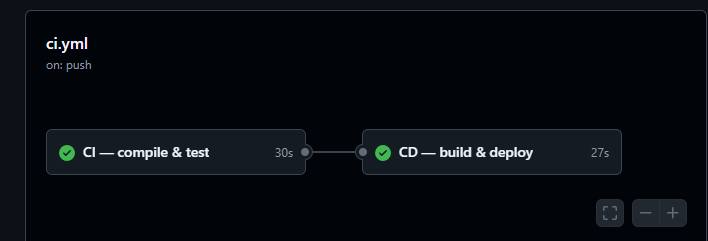
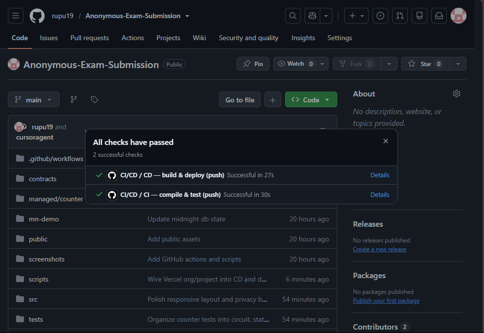
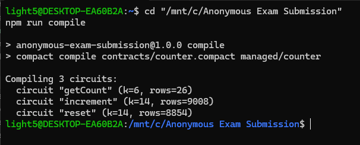
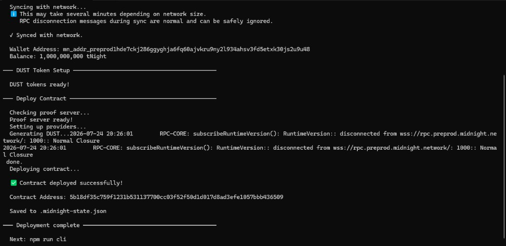
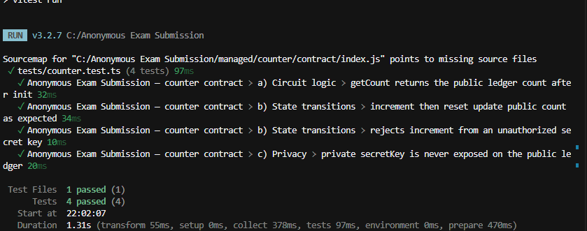

# Anonymous Exam Submission

> Privacy-preserving exam counter dApp on Midnight — prove authorization without revealing your secret.

## Live Demo
https://anonymous-exam-submission.vercel.app

## Contract Address
| Network  | Address                                                          |
|----------|------------------------------------------------------------------|
| Preprod  | afcffcebb57c90948e51acfde87e30d970d39dda004aaed058ede9df121f505c |

## What This Does
Anonymous Exam Submission is a privacy-first dApp on the Midnight Network. Institutions can track exam participation via a public on-chain counter, while students connect Lace wallet, generate a zero-knowledge proof in the browser, and call the Compact circuit — without ever putting their private secret key on the public ledger or on the UI.

## Privacy Model
- **PUBLIC:** The counter value (`count`), round, hashed owner commitment (`owner`), and the fact that an authorized circuit call occurred (tx id / block).
- **PRIVATE:** The student's `secretKey()` witness material and any non-disclosed circuit inputs (never rendered in the frontend).
- **PROVED without revealing:** Knowledge of the secret corresponding to the on-chain owner commitment — authorization to update state — without disclosing the raw secret.

## Privacy Claim
An on-chain observer can see that a `getCount` / `increment` / `reset` call happened, the resulting public ledger fields, and transaction metadata. They **cannot** see the caller's raw `secretKey` witness or any private circuit input that was not wrapped in `disclose()`. The UI also never displays private inputs: only public results (e.g. count, tx id) appear after submission.

## Tech Stack
Midnight Network, Compact, Midnight.js SDK, React / Vite, Lace wallet (`@midnight-ntwrk/dapp-connector-api`), Vitest, GitHub Actions CI

## Prerequisites
- Lace wallet installed ([Midnight Lace](https://chromewebstore.google.com/detail/lace/gafhhkghbfjjkeiendhlofajokpaflmk)) configured for **Preprod**
- Node.js v22
- Compact compiler (`compact compile`) — install via the [Midnight installer](https://docs.midnight.network/getting-started/installation)
- (Optional for local proving) Docker proof server if Lace is pointed at `localhost:6300`

## Setup & Run Locally
```bash
git clone https://github.com/rupu19/Anonymous-Exam-Submission.git
cd Anonymous-Exam-Submission
npm install
npm run compile   # compact compile contracts/counter.compact managed/counter
npm run dev       # http://localhost:5173
```

Deploy / interact via the Midnight CLI scaffold (`mn-demo`):
```bash
cd mn-demo
npm install
# Ensure Docker is running (proof server on :6300)
NODE_OPTIONS="--max-old-space-size=12288" npm run deploy:counter -- --network preprod
npm run network preprod
npm run cli
```

## Run Tests
```
npm test
```

## CI/CD
This repo uses a full **CI/CD** pipeline in GitHub Actions (`.github/workflows/ci.yml`):

| Stage | Job | What it does |
|-------|-----|----------------|
| **CI** | `CI — compile & test` | Checkout → Node 22 → `npm ci` → `compact compile` → `npm test` (runs on every push to `main` and every PR) |
| **CD** | `CD — build & deploy` | After CI passes on `main`: production `npm run build`, then deploy to Vercel production |

Badge at the top of this README reflects the latest workflow status:  


### CI/CD pipeline Screenshot


### CI/CD checks passed


## Product Proposal
See PROPOSAL.md

## Deploy frontend
Exact CLI commands (after `npm run build` succeeds):

**Vercel**
```bash
npm i -g vercel
vercel login
vercel --prod
```

**Netlify**
```bash
npm i -g netlify-cli
netlify login
netlify deploy --prod --dir=dist
```

The live app reads `VITE_CONTRACT_ADDRESS` (defaults to the Preprod address above).

## Demo Videos
| Level | What it shows | Link |
|-------|---------------|------|
| Level 2 | Lace connect + successful `getCount` circuit call | https://youtu.be/2cqf9C8fBq8 |
| Level 3 | dApp flow + tests passing + CI badge | https://youtu.be/U48CDxdJTyw |

## Screenshots

### Successful Compilation Screenshot


### Successful Contract Deployed Screenshot


### Tests passing (Level 3)


### CI/CD pipeline green (Level 3)


### All CI/CD checks passed (Level 3)


## Project layout
```
├── contracts/counter.compact
├── managed/                  ← compact compile output (+ keys/zkir)
├── src/
│   ├── components/
│   │   ├── WalletConnect.tsx
│   │   └── CircuitCall.tsx
│   ├── hooks/
│   │   └── useMidnight.ts
│   ├── App.tsx
│   ├── main.tsx
│   └── witnesses.ts
├── public/                   ← ZK artifacts copied at build time
├── tests/
│   └── counter.test.ts
├── .github/workflows/ci.yml
├── PROPOSAL.md
├── vercel.json
├── netlify.toml
├── vite.config.ts
├── README.md
└── package.json
```

---

# Level 1 — Compact contract on Preprod

**Mission:** Compile a Compact contract and deploy it to Midnight Preprod.

## Level 1 Submission

| Field | Value |
|-------|--------|
| **Public GitHub repository** | https://github.com/rupu19/Anonymous-Exam-Submission |
| **Preprod contract address** | `afcffcebb57c90948e51acfde87e30d970d39dda004aaed058ede9df121f505c` |
| **Compile evidence** | See Screenshots → Successful Compilation |
| **Deploy evidence** | See Screenshots → Successful Contract Deployed |

### Level 1 checklist
- [x] Compact contract source (`contracts/counter.compact`)
- [x] Compiled managed artifacts (`managed/counter`)
- [x] Deployed Preprod contract address
- [x] Compile + deploy screenshots in README

---

# Level 2 — The First Thread of Light

> You wire your contract to a real frontend and bring Lace onto Preprod. For the first time your work has a face the world can glimpse — a thin, deliberate crescent. Most of it still rests in shadow; you have simply chosen to reveal the edge.

**Mission this cycle:** Contract wired to a frontend UI, with Lace connected on Preprod.

## Who Can Join
Open to developers who have completed Level 1 or have equivalent experience, with a deployed Compact contract and readiness to learn the Midnight.js SDK and DApp connector.

## What You Will Learn
- Midnight.js SDK and the DApp connector API
- Connecting and disconnecting the Lace wallet
- Calling a circuit from the frontend and handling its result
- Managing local private state; deploying to Preprod

## Requirements to Pass
- Lace wallet connect / disconnect implemented
- Circuit called successfully from the frontend
- An observable privacy behavior (something proven without being shown)
- Contract deployed to Preprod with a verifiable address
- Minimum 8 meaningful commits

## Level 2 Submission

| Field | Value |
|-------|--------|
| **Public GitHub repository** | https://github.com/rupu19/Anonymous-Exam-Submission |
| **Live demo** | https://anonymous-exam-submission.vercel.app |
| **Preprod contract address** | `afcffcebb57c90948e51acfde87e30d970d39dda004aaed058ede9df121f505c` |
| **Demo video** | https://youtu.be/2cqf9C8fBq8 |
| **Privacy claim** | Documented above under **Privacy Claim** / **Privacy Model** |
| **Meaningful commits** | 21+ (exceeds the minimum of 8) |

### Submission Checklist
- [x] Public GitHub repository with README
- [x] Live demo link (Vercel)
- [x] Deployed Preprod contract address (verifiable on-chain)
- [x] Demo video: wallet connect + a successful circuit call — https://youtu.be/2cqf9C8fBq8
- [x] README documenting the privacy claim
- [x] Minimum 8 meaningful commits

### Level 2 features in this repo
- **Lace connect / disconnect** — `src/components/WalletConnect.tsx` via `@midnight-ntwrk/dapp-connector-api`
- **Circuit calls from the frontend** — `getCount` / `increment` / `reset` in `src/components/CircuitCall.tsx` + `src/hooks/useMidnight.ts`
- **Observable privacy behavior** — authorization is proven with a ZK proof; the raw `secretKey` witness is never shown in the UI or put on the public ledger (see Privacy Claim)
- **Preprod deploy** — contract address above; frontend defaults to that address via `VITE_CONTRACT_ADDRESS` / `src/config.ts`

---

# Level 3 — Tests, CI/CD, and product proposal

**Mission:** Harden the dApp with tests, CI, polished UX, and a product proposal toward Mainnet.

## Level 3 Submission

| Field | Value |
|-------|--------|
| **Public GitHub repository** | https://github.com/rupu19/Anonymous-Exam-Submission |
| **Live demo** | https://anonymous-exam-submission.vercel.app |
| **Preprod contract address** | `afcffcebb57c90948e51acfde87e30d970d39dda004aaed058ede9df121f505c` |
| **Demo video** | https://youtu.be/U48CDxdJTyw |
| **Product proposal** | [PROPOSAL.md](./PROPOSAL.md) |
| **CI** |  |

### Submission Checklist
- [x] 3+ tests passing (circuit, state, privacy) — `npm test`
- [x] CI/CD pipeline on push / pull_request (`.github/workflows/ci.yml`)
- [x] CI badge in README
- [x] Contract address in README
- [x] Privacy Model section in README
- [x] PROPOSAL.md filled
- [x] dApp builds with zero errors
- [x] Demo video — https://youtu.be/U48CDxdJTyw

See also [LEVEL3.md](./LEVEL3.md).
